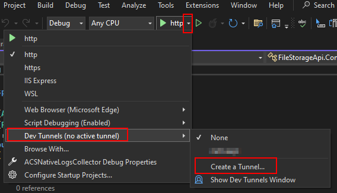
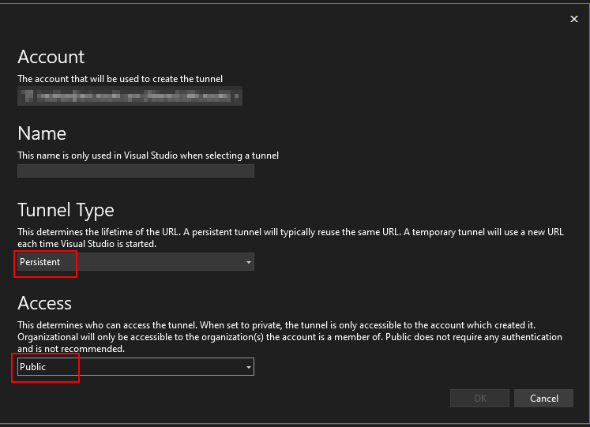
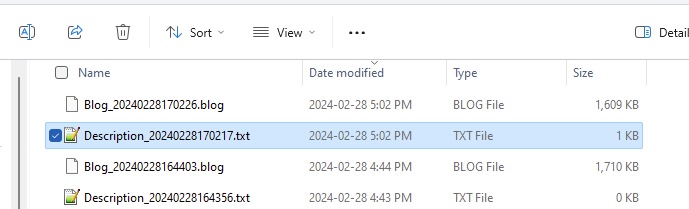

|page_type|languages|products
|---|---|---|
|sample|<table><tr><td>csharp</tr></td></table>|<table><tr><td>azure</td><td>azure-communication-services</td></tr></table>|

# Native Call Logs Collector

In this sample, You can collect all the native SDK logs from ACS apps to share it with ACS support team

## Prerequisites

- Create and host a Azure Dev Tunnel. Instructions [here](https://learn.microsoft.com/en-us/azure/developer/dev-tunnels/get-started)
- [.NET7 Framework](https://dotnet.microsoft.com/en-us/download/dotnet/7.0) (Make sure to install version that corresponds with your visual studio instance, 32 vs 64 bit)
- Create `Dev Tunnels`, for more details about [Dev Tunnels.](https://learn.microsoft.com/en-us/aspnet/core/test/dev-tunnels?view=aspnetcore-7.0)
  
	
	

- Get devTunnel URL to use it in your native ACS application that has log sharing feature enabled

## Recieved Logs
- The logs should be saved in .\ACSNativeLogsCollector\SavedFiles as shown below
  
